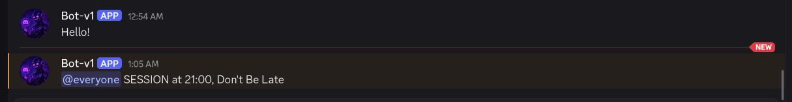
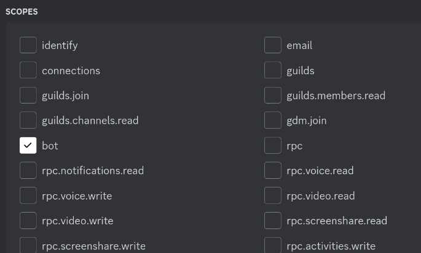
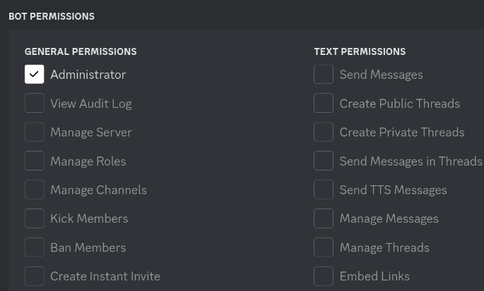
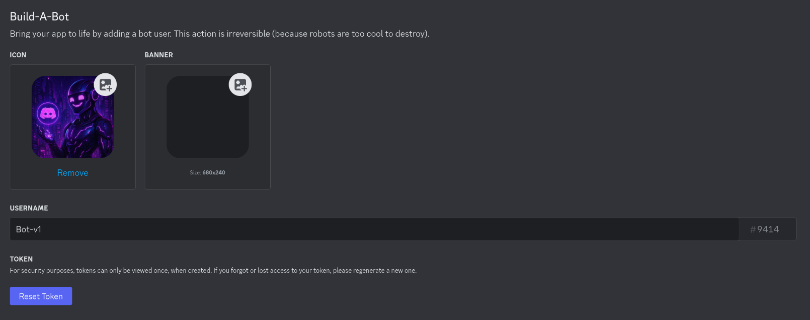
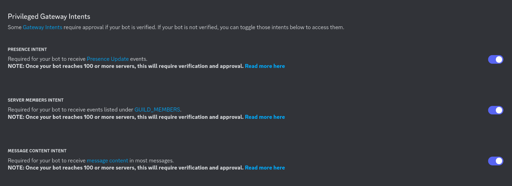

# Purpose:
i made this for my discord server and to learn a bit of web api with pyhton
it doesnt do much now :
it has a `!hello` command, when typed the bot responds with Hello
and it has remienders of groups sessions in the discord server Like so:

# How to make a Discord Bot

There are two key steps when you’re creating a bot:
1. Create the bot user on Discord and register it with a guild.
2. Write code that uses Discord’s APIs and implements your bot’s behaviors.

## First Create your bot in Discord
There are two key steps when you’re creating a bot:
1. Create the bot user on Discord and register it with a guild.
2. Write code that uses Discord’s APIs and implements your bot’s behaviors.

## We Generate a OAuth 2 link 
go Here: [Discord Dev Portal](https://discord.com/developers/applications)



past the url link in the browser and choose the server/guild
## Make the bot and Generate the Token
we will past the token in the `.env` file later

### Enable Privileged Intents in the Discord Developer Portal:
+ Navigate to the Discord Developer Portal and log in.​
+ Select your application (bot) from the list.​
+ Click on the "Bot" tab on the left sidebar.​
- In the "Privileged Gateway Intents" section, you'll find three options:​
	- Presence Intent: Allows your bot to receive presence updates (e.g., when users come online or go offline).​
	- Server Members Intent: Allows your bot to receive updates about server members (e.g., when users join or leave).​
	- Message Content Intent: Allows your bot to read message content in servers.​
- Enable the intents that your bot requires by toggling them on. For example, if your bot needs to read messages and respond, enable the Message Content Intent.​
- Save your changes.


## Making a Discord Bot in Python

Since you’re learning how to make a Discord bot with Python, you’ll be using `discord.py`.

[`discord.py`](https://discordpy.readthedocs.io/en/latest/index.html) is a Python library that exhaustively implements Discord’s APIs in an efficient and Pythonic way. This includes utilizing Python’s implementation of [Async IO](https://realpython.com/async-io-python/).

Begin by installing `discord.py` with [`pip`](https://realpython.com/what-is-pip/):
```shell
pip install -U discord.py
```

### Creating a Connection
The first step in implementing your bot user is to create a connection to Discord. With `discord.py`, you do this by creating an instance of `Client`:

```python
# bot.py
import os

import discord
from dotenv import load_dotenv

intents = discord.Intents.default()
intents.typing = False
intents.presences = False

load_dotenv()
TOKEN = os.getenv('DISCORD_TOKEN')
client = discord.Client(intents=intents)

@client.event
async def on_ready():
	print(f'{client.user} has connected to Discord!')

client.run(TOKEN)
```

With a `.env` file:
```shell
# .env
DISCORD_TOKEN={DISCORD TOKEN}
```

now run your code youll see this in the console:

```bash
python bot.py
```

```bash
2025-03-30 01:00:32 INFO     discord.client logging in using static token
2025-03-30 01:00:34 INFO     discord.gateway Shard ID None has connected to Gateway (Session ID: ).
Bot-v1#9414 has connected to Discord!
```
